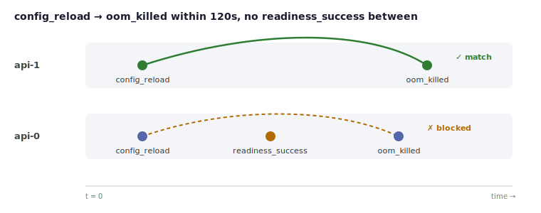

# What is Epigrep?

**Grep is good at lines. Epigrep is for sequences.**

Epigrep finds temporal patterns in partitioned, timestamped event sequences.
Where grep matches a line and SQL matches a row, Epigrep matches an ordered
*sequence* of events that unfolds over time, within one partition, inside a time
budget, optionally with a clause saying what must *not* happen in between.

The same idea works whether your events are parcels or pods. Here it is both
ways.

## A parcel that didn't arrive cleanly

Think of a courier's tracking history — a sequence of events, grouped by parcel,
in time order:

```text title="tracking"
Parcel 7Q   Mon 09:14   dispatched
Parcel 7Q   Tue 11:02   out_for_delivery
Parcel 7Q   Tue 17:40   failed_attempt      (nobody home)
Parcel 7Q   Wed 12:20   delivered
Parcel 3B   Mon 16:30   dispatched
Parcel 3B   Tue 10:15   out_for_delivery
Parcel 3B   Tue 13:05   delivered
```

You want the parcels that went **out for delivery and then arrived, with no
failed attempt in between** — a clean first-time delivery, per parcel:

```python
pattern = (
    Pattern.event("out_for_delivery")
    .then("delivered", no="failed_attempt")
    .build()
)
```

Epigrep returns parcel **3B** as a match. Parcel **7Q** is a *near-miss*: it did
eventually arrive, but a `failed_attempt` sits between the two steps, so the
"no failed attempt" clause rules it out — and Epigrep tells you that is why. No
order-by, no self-join, no manual grouping.

## The same shape in your logs

Operational logs are the case Epigrep leads with: it is where grep and SQL hurt
most, and where most people will reach for it first. The machinery is the same;
here the events are structured log lines, grouped by pod instead of by parcel:

```text title="app.log"
09:00:00   api-1   config_reload
09:01:30   api-1   oom_killed
09:00:00   api-0   config_reload
09:00:30   api-0   readiness_success
09:01:10   api-0   oom_killed
```

The question — *config reload, then an OOM within two minutes, with no readiness
success in between, per pod* — is painful in grep (no order, no windows),
awkward in SQL (self-joins and `NOT EXISTS` per gap), and fiddly in pandas. In
Epigrep it is the same two-step pattern as the parcel:

```python
pattern = (
    Pattern.event("config_reload")
    .then("oom_killed", within=120, no="readiness_success")
    .build()
)
```



`api-1` matches. `api-0` is a near-miss — a `readiness_success` lands between the
reload and the OOM, so the process recovered and it is not the failure we are
hunting.

## What you get back

For each start position Epigrep tells you one of two things:

- a **match** — the participating event indices, the span (start and end
  timestamps), and any captured attribute values; or
- a **near-miss explanation** — for starts that cannot complete, the deepest
  partial path it reached and the reason the next step failed (a predicate, a
  blocking event, an exceeded window, or simply no successor).

The explanation is the part that is hard to get from grep, SQL, or pandas: not
just *that* something did not match, but *why*.

## How it works

- The **semantics are written down and tested**, not implied by the code. A
  naive reference matcher is the source of truth, and a second, independent
  implementation is checked against it by property tests.
- A small **Rust core** does the matching; a **Python API** is the surface.
- Patterns are built with a **Python builder** or a **stable JSON format**; the
  text DSL is experimental.

## Where next

- [Getting started](getting-started.md) — build it and run your first match.
- [Events and partitions](events-and-partitions.md) — the input model.
- [Patterns](patterns.md) — how to express what you are looking for.
- [Semantics](semantics.md) — exactly what a match and a non-match mean.
- [Explanations](explanations.md) — near-misses and what they do and do not promise.
- [Logs-first recipes](logs-first-recipes.md) — worked observability examples.
- [Limitations](limitations.md) — the boundaries of the 0.1 release.

!!! note "Status"
    Alpha (0.1.0). Published to PyPI — `pip install epigrep`. The Python API and
    JSON pattern format are the intended stable surface; the text DSL is
    experimental.
